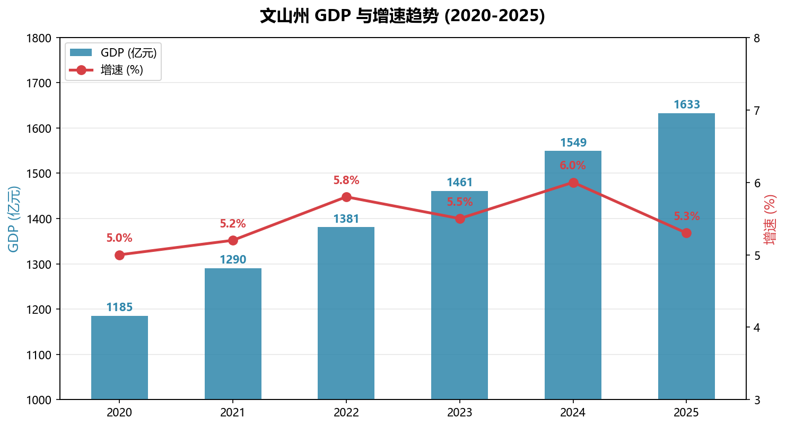
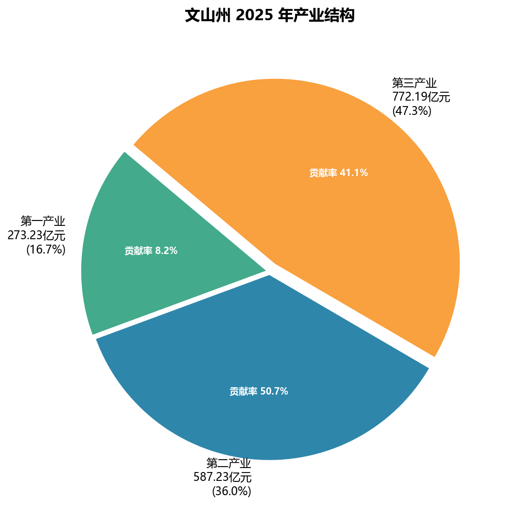

---
tags: [总览, 数据, 速查]
created: 2026-05-24
updated: 2026-06-11
confidence: 低
sources:
  - "政府统计年鉴"
related:
  - "文山州总览"
  - "[[../01-地理与自然环境/_索引]]"
  - "[[../02-历史沿革/_索引]]"
  - "[[../03-行政区划/_索引]]"
  - "[[../04-人口与民族/_索引]]"
  - "[[../05-经济发展/_索引]]"
  - "[[../06-文化旅游/_索引]]"
  - "[[../07-特产与资源/_索引]]"
  - "[[../08-交通与基础设施/_索引]]"
  - "[[../09-政策与治理/_索引]]"
  - "[[../10-社会民生/_索引]]"
---
# 文山州核心数据速查

## 2025年关键数据

- GDP：**1632.64 亿元**（+5.3%）
- 第一产业：273.23 亿元 | 第二产业：587.23 亿元 | 第三产业：772.19 亿元
- 常住人口：335.4 万（2025年末） [置信度: 中]
- 绿色铝产能：343 万吨（全省 52.8%，全国 7.7%），产值 **1000 亿元**（首次突破千亿，占全省半壁江山）
- 中药材产业综合产值：**456 亿元**（+10.4%，以三七为主）；三七产业综合产值 **220 亿元**（同比 +7%，来源：科技日报 2026-06-07）
- 旅游接待：**5256.7 万人次**（+5.1%），旅游花费 **425.7 亿元**（+8.4%）
- A 级景区：**64 家**（5A：1家，4A：7家）
- 高速公路通车里程：**650 公里**
- 森林覆盖率：**44.37%**
- 城镇化率：**41.19%**（较"十三五"末提升 3.37 个百分点）

## "十四五"成就（2021-2025）

| 指标 | 2020 年 | 2025 年 | 年均增速 |
|------|----------|----------|----------|
| GDP | 1632.64 亿元 | 1632.64 亿元 | **6.3%** |
| 规上工业总产值 | 545.8 亿元 | 1539 亿元 | — |
| 一般公共预算收入 | — | 74.12 亿元 | 高于全省平均 |
| 农村居民人均可支配收入 | — | 17501 元 | 高于全省平均 |
| 高速公路里程 | — | 650 公里 | — |
| 城镇化率提升 | — | +3.37 个百分点 | — |
| R&D 经费投入 | — | **翻番** | — |
| 高新技术企业 | — | **70 户** | — |

## 2026年预期目标

| 指标 | 目标 |
|------|------|
| GDP 增长 | **5% 以上** |
| 规上工业增加值增长 | **10% 以上** |
| 绿色铝产值增长 | **20% 以上** |
| 三七综合产值 | **220 亿元以上**（核心品种口径；中药材全口径 456 亿元以上，2026年目标 500 亿+） |
| 社会消费品零售总额增长 | **4%** |
| 居民人均可支配收入 | 与经济增长基本同步 |
| 重大项目 | **166 个**（亿元以上） |

## 全省排名

| 指标 | 排名 |
|------|------|
| 面积 | 第3位 |
| GDP（2024） | 第8位 |
| GDP 增速（2024） | 第1位 |
| 规上工业增加值增速（2024） | 第1位 |
| 用电量及增速 | 第1位 |
| 绿色铝产能 | 第1位 |

## 2026年最新数据

> 来源：人民网 2026-06-08、文山发布网 2026-06-03、科技日报 2026-06-07

| 指标 | 数值 | 说明 |
|------|------|------|
| 规上工业增加值（1-4月） | **+13.9%** | 高出全省 15.1 个百分点 |
| 绿色铝产值（一季度） | **434.55 亿元**（2026年Q1季度值，全年锚点1016亿） | 同比 +44%，占规上工业 68.2% |
| 旅游花费（1-4月） | **149.79 亿元** | 同比 +3.99% |
| 农林牧渔总产值（1-3月） | **56.81 亿元** | 同比 +2.5% |
| 三七中药材综合产值（一季度） | **77.43 亿元**（2026年Q1季度值，全年锚点456亿） | 同比 +4.48% |
| 旅居人数（2025年） | **16.63 万人** | 同比 +49.82% |
| 招商引资签约（1-4月） | **28 个项目** | 协议总投资 27.81 亿元 |

### 产业带动就业增收（2025-2026年6月）

| 产业 | 带动规模 | 收入水平 |
|------|---------|----------|
| 绿色铝 | 直接就业 **1.3 万余人** | 本地稳定就业 |
| 三七中药材 | **2 万余户**增收，年务工 **20 万人次** | 户均年增收约 **3 万元** |
| 林下经济 | **31 万**群众就地就业 | 年人均增收 **1.45 万元** |
| 省外旅居（2025年） | **16.63 万人** | 同比 +49.82% |
