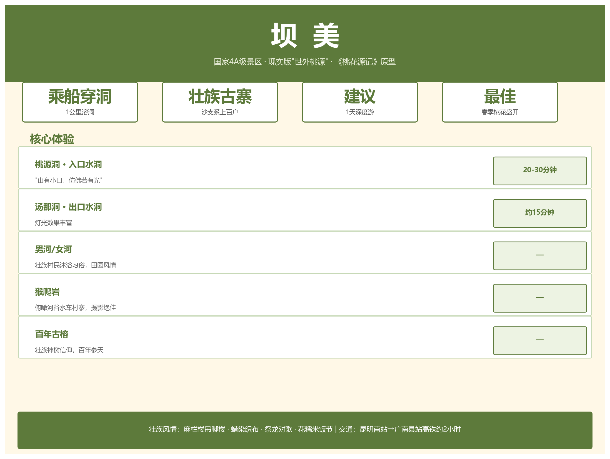

---
tags:
  - 旅游
  - 坝美
  - 世外桃源
  - 壮族
  - 4A景区
  - 攻略
created: 2026-05-30
sources:
  - "https://www.gnbmta.com (坝美世外桃源景区官方)"
  - "携程/马蜂窝坝美景区页面"
  - "广南县文化旅游局公布信息"
related:
  - "[[文山旅游总览]]"
  - "[[普者黑旅游攻略]]"
  - "[[主要景点介绍]]"
  - "[[../03-行政区划/广南县深度]]"
  - "[[广南八宝米]]"
  - "[[../08-交通与基础设施/交通概况]]"
---

# 坝美旅游攻略



> 现实版"世外桃源" · 乘船穿洞 · 壮族古寨 · 国家 4A 级景区

---

## 一、景区概览

| 参数 | 详情 |
|------|------|
| 等级 | **AAAA** |
| 位置 | 文山州广南县坝美镇，距县城约 40 公里 |
| 核心体验 | 乘船穿越 1 公里溶洞，豁然开朗见壮族古寨 |
| 原型 | 陶渊明《桃花源记》——"山有小口，仿佛若有光" |
| 民族 | 壮族"沙支系"，上百户人家 |
| 建议时长 | 1 天（深度体验 2 天 1 晚） |

---

## 二、核心景点

### 2.1 溶洞穿行

| 景点 | 方向 | 时长 | 特点 |
|------|------|------|------|
| **桃源洞** | 入口水洞 | 20-30 分钟 | "山有小口"，钟乳石林立，经典桃花源意境 |
| **汤那洞** | 出口水洞 | ~15 分钟 | 灯光效果更丰富 |

### 2.2 村内景观

| 景点 | 特色 |
|------|------|
| **桃花岛** | 驮娘江分流环绕，与稻田水车相映 |
| **男河 / 女河** | 当地村民夏季沐浴习俗，田园风情 |
| **猴爬岩** | 乘船前往，俯瞰河谷、水车和村寨，摄影绝佳 |
| **古榕树** | 村中多株百年古榕，壮族"神树"信仰 |

### 2.3 壮族民俗

| 内容 | 说明 |
|------|------|
| 建筑 | 麻栏楼（壮族传统干栏式吊脚楼） |
| 手工艺 | 蜡染、织布 |
| 节庆 | 祭龙、对歌、花糯米饭节 |
| 生活 | 自给自足的农耕生活 |

---

## 三、交通指南

### 3.1 抵达广南县

| 方式 | 路线 | 耗时 |
|------|------|------|
| **高铁（推荐）** | 昆明南站 → 广南县站 | **约 2 小时** |
| 长途汽车 | 昆明 → 文山 → 广南 | 6-7 小时 |
| 自驾 | 昆明 → 广昆高速"广南/那洒"出口 → 广南 | ~5 小时 |

### 3.2 广南县城 → 坝美景区

| 方式 | 耗时 | 说明 |
|------|------|------|
| 3 路旅游专线 | 1-1.5 小时 | 广南客运站乘巴士直达 |
| 包车 / 网约车 | ~1 小时 | 更便捷，适合家庭/多人出行 |
| 自驾 | ~1 小时 | 山路弯多，谨慎驾驶 |

---

## 四、最佳旅游季节

| 季节 | 月份 | 景色 | 推荐 |
|------|------|------|------|
| **春季** | 3-5 月 | 桃花油菜花盛开，摄影黄金期 | ★★★★★ |
| **秋季** | 9-11 月 | 稻谷金黄，景色治愈，适合慢游 | ★★★★★ |
| 夏季 | 6-8 月 | 绿意盎然但雨多，溶洞潮湿 | ★★★ |
| 冬季 | 12-2 月 | 游客少，宁静萧瑟 | ★★★ |

> **最佳**：3-5 月桃花季和 9-11 月稻香季。

---

## 五、门票信息

### 5.1 常规门票

| 类型 | 价格 | 包含 |
|------|------|------|
| 标准票 | **100 元/人** | 桃源洞、汤那洞、猴爬岩、桃花谷 4 景点 + 三段船票 + 一段马车 |

### 5.2 坝美 99 元通行证

- 自 **2025 年 12 月 1 日**推出
- 售价 99 元，有效期 **396 天**
- **无限次入园**，适合多次前往

> 购票渠道："坝美世外桃源景区"官方公众号 / 携程，出行前建议核实最新政策。

---

## 六、住宿推荐

| 类型 | 价位 | 代表 | 特点 |
|------|------|------|------|
| **村内民宿** | 150-400 元/晚 | 榕树下民宿、缘溪园客栈、绿满岛 | 吊脚楼体验，晨昏静谧，农家菜 |
| **县城酒店** | 200-500 元/晚 | 特安呐酒店等 | 设施完善，选择多 |

> 旺季（节假日）建议提前预订村内民宿。

---

## 七、行程推荐

### 一日游

```
广南县城出发 → 桃源洞乘船入村 → 村寨漫步/桃花岛 
→ 猴爬岩观景 → 汤那洞乘船出村 → 返程
```

### 两日深度

| 时间 | 行程 |
|------|------|
| Day 1 | 中午入村 → 下午村寨漫步、古榕树、水车田园 → 夜宿民宿 |
| Day 2 | 清晨河谷晨雾 → 猴爬岩 → 壮族手工艺体验 → 下午出村返程 |

---

## 八、实用贴士

| 类别 | 提醒 |
|------|------|
| **穿着** | 防滑运动鞋/徒步鞋（石板路、上下船） |
| **防水** | 溶洞潮湿滴水，手机相机用防水袋 |
| **预订** | 节假日提前预订往返票和住宿 |
| **尊重** | 拍照前征得村民同意，尊重壮族习俗 |
| **信号** | 村内部分区域信号弱，提前下载离线地图 |

---

## 九、与普者黑比较

| 维度 | 普者黑 | 坝美 |
|------|--------|------|
| 等级 | 5A | 4A |
| 核心意象 | 喀斯特山水田园、万亩荷花 | 世外桃源、桃源穿洞 |
| 游玩方式 | 游船打水仗、登山观景 | 乘船穿洞、古寨漫步 |
| 旺季 | 6-9 月荷花季 | 3-5 月桃花季 |
| 适合人群 | 家庭、年轻群体、摄影 | 文艺、慢游、文化体验 |
| 游览时长 | 1-2 天 | 1-2 天 |
| 交通 | 高铁直达普者黑站 | 高铁到广南县站 + 1 小时乘车 |

> 参见：[[普者黑旅游攻略]] | [[文山旅游总览]]

---

## 十、周边联动

坝美所在的广南县，还可串游：

| 景点 | 距离 | 特色 |
|------|------|------|
| 八宝风景区 | ~60 km | 八宝米原产地、喀斯特峰丛 |
| 广南古城 | 县城内 | 句町古国文化 |
| 普者黑 | ~150 km | 5A 级山水田园 |

---

> **关联阅读**：[[普者黑旅游攻略]] | [[文山旅游总览]] | [[广南八宝米]]