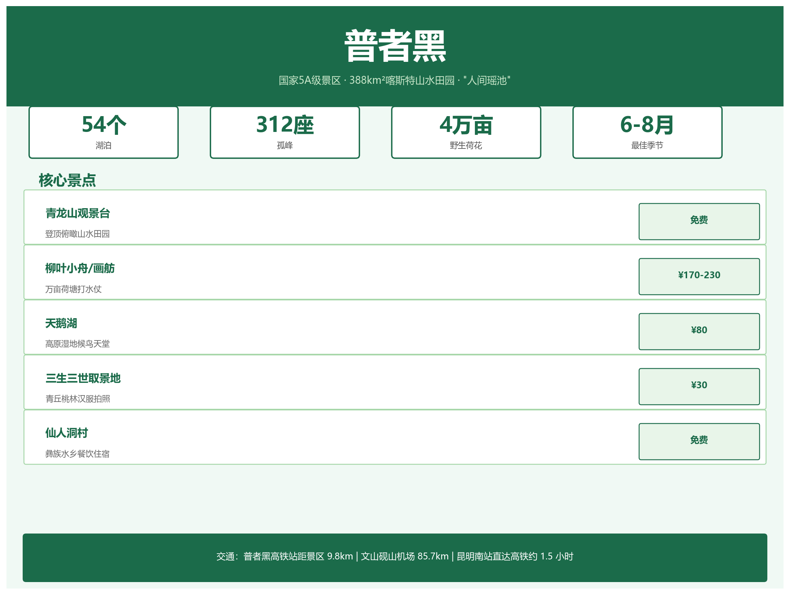

---
tags:
  - 旅游
  - 普者黑
  - 5A景区
  - 攻略
  - 荷花
  - 喀斯特
created: 2026-05-30
sources:
  - "https://www.puzhehei.com (普者黑景区官网)"
  - "携程/同程普者黑景区页面"
  - "云南文旅厅普者黑专题"
related:
  - "[[文山旅游总览]]"
  - "[[坝美旅游攻略]]"
  - "[[主要景点介绍]]"
  - "[[../03-行政区划/丘北县深度]]"
  - "[[../08-交通与基础设施/文山砚山机场]]"
---

# 普者黑旅游攻略



> 国家 5A 级景区 · 388 km² 喀斯特山水田园 · 4 万亩野生荷花 · "人间瑶池"

---

## 一、景区概览

| 参数 | 详情 |
|------|------|
| 等级 | **AAAAA** |
| 面积 | 总面积 388 km²，核心区 15 km² |
| 地貌 | 喀斯特峰林 + 高原湖泊群 |
| 湖泊数量 | **54 个** |
| 孤峰数量 | **312 座** |
| 荷花面积 | **4 万亩**野生荷花 |
| 所属 | 文山州丘北县 |

---

## 二、核心景点

### 2.1 免费区域

| 景点 | 特色 |
|------|------|
| **普者黑村** | 彝族水乡，看日出方便 |
| **仙人洞村** | 餐饮住宿集中，夜生活丰富 |
| **青龙山观景台** | 登顶 10-20 分钟，俯瞰山水田园全景，日出/日落/晨雾必去 |
| **西荒湿地 & 情人桥** | 湿地步道散步拍照，情人桥赏日落 |
| **喀斯特国家湿地公园** | 栈道漫步，观水鸟与峰林倒影 |

### 2.2 收费项目

| 项目 | 票价 | 亮点 |
|------|------|------|
| **柳叶小舟 / 画舫游船** | ~170-230 元/人 | 夏季万亩荷塘打水仗，含船票+观光车，全程 40-60 分钟 |
| **天鹅湖（嗨努咪嘚）** | ~80 元/人 | 高原湿地候鸟栖息地，冬季观鸟 |
| **溶洞（火把洞/观音洞）** | ~30-50 元/个 | 恒温钟乳石溶洞，灯光绚丽 |
| **三生三世取景地** | ~30 元/人 | 青丘石桥、桃林布景，汉服拍照 |

> 景区本体免费，以上为单独收费体验项目。

---

## 三、最佳旅游季节

| 季节 | 月份 | 特点 | 推荐指数 |
|------|------|------|----------|
| **夏季（旺季）** | 6-9 月 | 万亩荷花盛开，柳叶小舟打水仗 | ★★★★★ |
| 春季 | 3-5 月 | 气候舒适，山花烂漫，游客较少 | ★★★★ |
| 秋季 | 10-11 月 | 金黄稻田风光，清静慢游 | ★★★★ |
| 冬季 | 11-2 月 | 候鸟归来，晨雾如画，气温偏低 | ★★★ |

> **一句话选季**：荷花打水仗 → 6-8 月；清净性价比 → 春秋；摄影候鸟 → 冬季。

---

## 四、交通指南

### 4.1 外部交通

| 方式 | 路线 | 耗时 | 费用 |
|------|------|------|------|
| **高铁（推荐）** | 昆明南站 → 普者黑站 | **1-1.5 小时** | ~70-80 元 |
| 高铁站→景区 | 打车 / 公交 / 景区直通车 | ~20 分钟 | 20-30 元 |
| 自驾 | 昆明 → 广昆高速炭房出口 | 3-4 小时 | — |
| 飞机 | 飞文山砚山机场 → 乘车 | 1.5 小时 | — |
| 飞机 | 飞昆明长水 → 换高铁 | 1+ 小时 | — |

### 4.2 内部交通

| 方式 | 费用 | 说明 |
|------|------|------|
| 观光车 | ~80-100 元/天 | 核心景点循环通票 |
| 电瓶车 | ~60-80 元/天 | 村寨和湖边短途 |
| 马车 | ~5-10 元/人 | 上车前议价 |
| 游船 | 含在船票内 | 柳叶小舟 / 画舫船 |

---

## 五、住宿推荐

| 区域 | 价位 | 特点 |
|------|------|------|
| **仙人洞村** | 400-800 元/晚（旺季湖景） | 临湖客栈集中，餐饮热闹，拍照出片 |
| **普者黑村** | 150-500 元/晚 | 近青龙山日出点，更原生态，性价比高 |
| **白脸山村/小红坡村** | 200-400 元/晚 | 近荷花池与湿地，安静田园风 |
| **高端野奢/房车营地** | 400-1000 元/晚 | 太空舱、湖景房车，度假体验 |

> 旺季（6-8 月及节假日）务必**提前 1-2 周预订**。

---

## 六、行程推荐

### 一日精华

```
青龙山日出 → 柳叶小舟打水仗 → 三生三世取景地 
→ 仙人洞村晚餐 & 篝火晚会
```

### 两日深度

| 时间 | 行程 |
|------|------|
| Day 1 | 上午抵达入住 → 下午柳叶小舟 → 晚上仙人洞村 |
| Day 2 | 清晨青龙山日出 → 天鹅湖 / 湿地徒步 → 下午返程 |

---

## 七、实用贴士

| 类别 | 提醒 |
|------|------|
| **防晒** | 高原紫外线强，防晒霜 + 帽子 + 墨镜必备 |
| **防蚊** | 夏季湿地蚊虫多，携带驱蚊液 |
| **玩水** | 穿泳衣打水仗，自备手机防水袋（景区外买更便宜） |
| **尊重习俗** | 彝族村寨拍照前征得同意 |
| **环保** | 勿采荷花，勿丢垃圾 |

---

## 八、门票政策

| 条件 | 政策 |
|------|------|
| 1.2 米以下儿童 | 免票 |
| 6-18 岁 / 学生 / 60-69 岁 | 半价 |
| 70 岁以上 / 残疾人 / 现役军人 | 免票（船票另购） |

**购票渠道**："普者黑景区"公众号/小程序、携程、同程，或景区游客中心。

---

> **关联阅读**：[[文山旅游总览]] | [[坝美旅游攻略]] | [[文山砚山机场]]