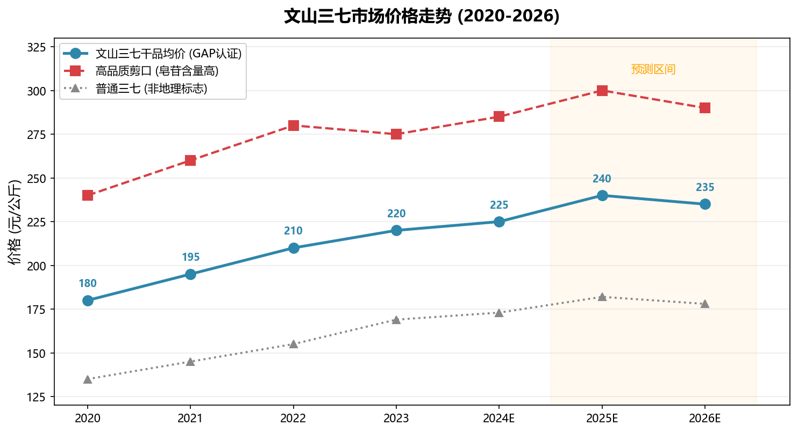

# 文山三七产业链深度

> 深度专题笔记 — 从种植技术演进到国际品牌战略的文山三七全产业链剖析。

---

## 一、产业概览

文山是中国三七（Panax notoginseng）的原产地和绝对主产区，全国 **90% 以上**的三七产自文山。三七被誉为"金不换"，是活血化瘀类中成药的核心原料，代表性药品包括云南白药、片仔癀、血塞通（三七总皂苷）等。

| 指标 | 2023 年 | 2025 年目标 |
|------|---------|-------------|
| 种植面积 | 约 15 万亩 | 12-16 万亩 |
| 干三七产量 | 约 2 万吨 | 1.8-2.2 万吨 |
| 综合产值 | 突破 200 亿元 | 350 亿元 |
| 年增速 | 8-10% | 8-10% |

> 关联阅读：[[../05-经济发展/三七产业|三七产业]]、[[三七|三七特产]]

---

## 二、种植技术演进（上游）

### 2.1 核心挑战：连作障碍

三七种植最大的技术瓶颈是**连作障碍**——同一块土地种植三七后，需间隔 **10-15 年**才能再次种植，否则根腐病爆发率极高。这严重制约了种植面积扩张。

### 2.2 突破性技术

| 技术方向 | 关键进展 | 效果 |
|----------|----------|------|
| **轮作模式** | "三七—玉米/烟草"轮作、"林下三七"仿野生种植 | 部分缓解土地紧张，林下三七品质接近野生 |
| **良种选育** | "文山三七 1 号""滇七 1 号"已推广，抗病/高皂苷新品种在研 | 亩产稳定提升，抗逆性增强 |
| **绿色种植** | 有机肥替代化肥、木霉菌防治根腐病、GAP 规范种植 | 农药残留显著降低，符合药典新标准 |
| **数字化管理** | 物联网实时监测土壤温湿度/光照 | 种植标准化率从 30% 提升至 60%+ |
| **连作障碍攻关** | 云南农业大学解析三七基因组，揭示连作障碍分子机制 | 目标：轮作间隔缩短至 5-8 年 |

### 2.3 种植区域分布

| 主产区 | 优势 | 占比（估算） |
|--------|------|-------------|
| **文山市** | 核心产区，三七交易中心 | 35% |
| **砚山县** | 大规模基地化种植 | 30% |
| **马关县** | 高海拔冷凉气候，品质优 | 15% |
| **丘北县** | 轮作土地资源相对充裕 | 10% |
| 其他 | 麻栗坡、西畴等 | 10% |

> 关联阅读：[[../03-行政区划/文山市深度|文山市深度]]、[[../03-行政区划/砚山县深度|砚山县深度]]

---

## 三、加工链条（中游）

### 3.1 加工层级图谱

```
初加工（清洗/修剪/分级）
    ├── 三七主根 → 中药饮片 / 三七粉
    ├── 剪口 → 高皂苷含量提取物
    ├── 筋条 → 中端保健品原料
    └── 绒根 → 饲料添加剂 / 低端提取
        ↓
深加工
    ├── 中药饮片（三七粉、三七片）
    ├── 提取物（三七总皂苷、三七多糖）
    ├── 中成药（血塞通、云南白药、片仔癀）
    ├── 保健品（三七胶囊、口服液）
    └── 日化品（三七牙膏、面膜、护肤品）
```

### 3.2 加工技术升级

| 技术 | 传统水平 | 当前水平 | 突破方向 |
|------|----------|----------|----------|
| 皂苷提取率 | 约 20% | 30%+（超临界 CO₂萃取/大孔树脂） | 目标 35-40% |
| 质量控制 | 外观分级 | HPLC 指纹图谱 + 重金属/农残全检 | 2020 版药典标准全覆盖 |
| 产品形态 | 原料/初加工为主 | 加工转化率从 20%→50%（2023） | 目标 70% |
| 追溯体系 | 无 | "文山三七质量追溯平台"覆盖率 80% | 2026 年全覆盖 |

---

## 四、龙头企业

### 4.1 本地核心企业

| 企业 | 核心业务 | 规模（估算） |
|------|----------|-------------|
| **文山三七科技有限公司** | 全产业链（种植→加工→销售） | 年营收约 10 亿元 |
| **云南三七科技有限公司** | 提取物、保健品、化妆品 | 年营收约 8 亿元 |
| **文山州三七研究院（产业化板块）** | 品种选育 + 技术推广 + 成果转化 | — |
| **苗乡三七** | 高端有机三七种植与品牌化 | 定位精品市场 |

### 4.2 全国龙头在文山的布局

| 企业 | 文山布局 | 三七关联 |
|------|----------|----------|
| **云南白药** | 自有种植基地 + 加工厂 | 核心原料最大采购方之一 |
| **昆药集团** | 原料采购 + 合作种植 | 血塞通（三七总皂苷）系列产品的原料基地 |
| **片仔癀** | 长期供应商合作 | 三七是片仔癀核心成分之一 |
| **鸿翔药业（一心堂）** | 种植基地 + 终端零售 | 三七产品线上线下全渠道销售 |

---

## 五、科研院所与技术支撑

| 机构 | 研究方向 | 标志性成果 |
|------|----------|------------|
| **文山州三七研究院** | 品种选育、种植技术、病虫害防治 | 育成"文山三七 1 号"，制定多项种植/加工标准 |
| **云南农业大学** | 基因组学、连作障碍分子机制 | 解析三七基因组，揭示连作障碍成因 |
| **中国中医科学院中药研究所** | 药效物质基础、质量标准 | 支撑 2020 版《中国药典》三七标准修订 |
| **昆明理工大学** | 深加工技术（提取/纯化/制剂） | 开发三七皂苷高效提取工艺 |

### 2024-2026 年科研重点

1. **连作障碍突破**：分子育种 + 土壤微生物修复，目标轮作间隔缩短至 5-8 年
2. **新药开发**：心血管疾病、神经保护等新适应症研究
3. **高纯度提取**：皂苷纯度目标 90%+，满足欧美药典标准
4. **国际化**：推动三七进入 USP（美国药典）和 EP（欧洲药典）

---

## 六、市场价格分析



### 6.1 2023 年价格基准

| 品类 | 价格区间 | 说明 |
|------|----------|------|
| 三七主根（80 头） | 150-200 元/kg | 主流规格，交易量最大 |
| 三七剪口（高品质） | 250-300 元/kg | 皂苷含量最高，药企首选 |
| 三七筋条 | 100-130 元/kg | 保健品原料 |
| 三七粉（终端零售） | 300-500 元/kg | 品牌溢价差异显著 |
| 绿色三七（GAP 认证） | 溢价 30% | 干品均价约 220 元/kg |

### 6.2 价格波动因素

| 驱动因素 | 影响方向 | 典型场景 |
|----------|----------|----------|
| 气候异常（干旱/洪涝） | ↑ 10-20% | 2021 年干旱导致减产 |
| 病虫害爆发（根腐病） | ↑ 15-25% | 局部产区受损 |
| 药企集中采购 | ↑ 5-10% | 云南白药年度采购季 |
| 种植面积扩张 | ↓ 5-10% | 新产区进入收获期 |
| 政策收紧（药典新标准） | ↑（合规产能溢价） | 淘汰不合规小产能 |

### 6.3 2024-2026 年价格展望

| 年份 | 预测方向 | 幅度 | 理由 |
|------|----------|------|------|
| 2024 | 平稳 | ±5% | 供需平衡，无重大气候异常 |
| 2025 | 小幅上涨 | 5-8% | 保健品/化妆品市场扩张拉动需求 |
| 2026 | 稳中有降 | ±3% | 连作障碍缓解 + 种植面积小幅回升 |

---

## 七、品牌建设与地理标志保护

### 7.1 地理标志

| 维度 | 详情 |
|------|------|
| 获批时间 | 2002 年获原国家质检总局批准 |
| 保护范围 | 文山州 8 县（市）全境 |
| 授权企业 | 2023 年约 30 家，2024 年目标 40 家 |
| 法律依据 | 《地理标志产品保护规定》+《文山三七地理标志产品保护管理办法》 |

### 7.2 品牌价值

- **区域公共品牌**：2023 年品牌价值约 **200 亿元**（中国品牌价值评价）
- **品牌矩阵**：
  - 公共品牌：**"文山三七"**（云南省重点打造）
  - 企业品牌：云南白药、昆药集团、"苗乡三七"等
  - 产品品牌：血塞通、三七粉等终端产品

### 7.3 品牌推广渠道

| 渠道 | 形式 | 效果 |
|------|------|------|
| **文山三七节** | 每年举办，集展览/论坛/交易于一体 | 品牌曝光 + 商务对接 |
| **电商直播** | 抖音/淘宝等平台带货 | 线上销售额占比快速提升 |
| **国际展会** | 中国国际中医药博览会、世界中医药大会 | 拓展海外市场 |
| **产业旅游** | 三七种植基地观光 + 三七文化体验 | 赋能文旅融合 |

> 关联阅读：[[../06-文化旅游/砚山康养|砚山康养]]（三七养生旅游新业态）

---

## 八、2024-2026 年趋势与展望

### 机遇

1. **政策红利**：国家《"十四五"中医药发展规划》+ 云南省生物医药三年行动计划
2. **需求扩张**：人口老龄化 → 心血管用药增长；消费升级 → 保健品/化妆品市场
3. **技术突破**：连作障碍缓解、深加工技术提升、质量标准国际化
4. **RCEP 机遇**：东南亚市场对中医药认可度高，出口关税降低

### 挑战

1. **土地资源约束**：适宜种植土地有限，扩产空间接近天花板
2. **质量控制**：部分小企业/农户违规用药，品牌形象受损风险
3. **国际竞争**：越南、老挝尝试种植三七，长期可能冲击市场
4. **价格波动**：中药材市场的周期性波动难以完全规避

### 发展建议

```
短期（2024-2025）
  ├── 全产业链追溯覆盖率提升至 100%
  ├── 深化与云南白药/昆药/片仔癀的订单农业合作
  └── 建设文山三七国际交易中心（定价中心）

中期（2025-2027）
  ├── 突破连作障碍，轮作间隔缩短至 5-8 年
  ├── 推动三七进入 USP/EP 国际药典
  └── 培育 3-5 个十亿级三七品牌企业

长期（2027-2030）
  ├── 打造千亿级三七产业集群
  ├── 实现三七"品种权 + 品牌权 + 定价权"三权在手
  └── 建设世界三七之都，成为全球三七产业标准制定者
```

---

> 本文基于 2024-2026 年公开资料与研究数据综合撰写。关联：[[三七|三七特产基础]]、[[../05-经济发展/三七产业|三七产业总览]]、[[文山经济全景|经济全景中的三七定位]]、[[../10-社会民生/文山乡村振兴案例|三七产业在乡村振兴中的案例]]。

## 外部参考文献

- 国家药监局：2020版《中国药典》三七项 — https://www.nmpa.gov.cn
- 国家知识产权局：地理标志产品保护公告（文山三七）
- 云南省科技厅：云南省生物医药产业高质量发展三年行动计划 — https://kjt.yn.gov.cn
- 中国中药协会：三七行业年度报告
- 中国日报云南频道：文山三七产业专题报道
- 文山州三七和中医药产业发展中心：行业监测数据 — https://www.ynws.gov.cn
- 云南农业大学：三七连作障碍攻关研究（基因组学方向）
- 国际药用植物标准机构（IASP）：Panax notoginseng 国际标准