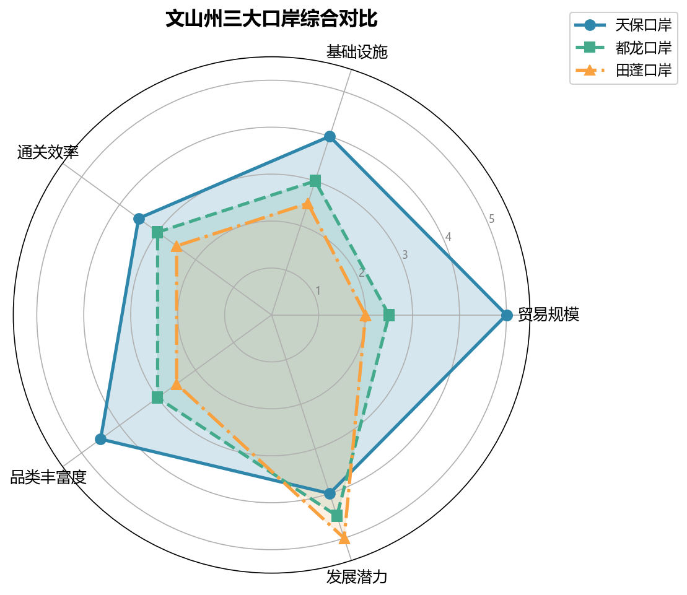

# 中越跨境经济合作区（文山段）

> 深度专题笔记 — 跨境合作机制、三大口岸对比、边民互市、跨境电商、RCEP 机遇全景分析。

---

## 一、战略定位

文山州拥有 438 公里国境线，是云南通往越南最便捷的陆路通道群。在国家"一带一路"和 RCEP 双重框架下，文山正从 **"对越作战原战区"** 转型为 **"中国西南面向东盟的开放前沿"**。

| 维度 | 定位 |
|------|------|
| 国家战略 | 一带一路 + 西部陆海新通道的重要节点 |
| 省级定位 | "3815"战略中口岸经济的核心承载区 |
| 州级战略 | 三大经济之一——口岸经济（与资源经济、园区经济并列） |
| 国际框架 | RCEP 框架下的中越跨境合作示范区 |

> 关联阅读：[[../09-政策与治理/发展战略|发展战略]]、[[../synthesis/文山发展时间线|发展时间线]]（1992 年经济转轨至今）

---

## 二、三大口岸对比

文山州形成**"天保为核心、都龙和田蓬为两翼"**的口岸群格局，三个口岸均为国家级一类口岸，但发展阶段与功能定位差异显著。



### 2.1 天保口岸（麻栗坡县）

| 维度 | 详情 |
|------|------|
| **口岸等级** | 国家一类口岸（1993 年恢复开通） |
| **对接越南** | 越南河江省清水口岸 → 河内（约 400 km） |
| **2025 年贸易额** | 占全州口岸贸易的 **60%+** |
| **核心功能** | 综合贸易（矿产品进口 / 农产品出口 / 工业品出口） |
| **基础设施** | 货场扩建中，"智慧口岸"建设推进 |
| **特色** | 中越边交会、"文山·睦邻"交流合作周举办地 |

**优势**：最成熟、贸易量最大、配套设施最完善
**瓶颈**：通关能力接近上限，需扩建货场与智能化升级

### 2.2 都龙口岸（马关县）

| 维度 | 详情 |
|------|------|
| **口岸等级** | 国家一类口岸（近年升级） |
| **对接越南** | 越南箐门口岸 |
| **核心功能** | 矿产进口（锌精矿等）+ 农产品出口 |
| **基础设施** | 处于完善期，通关流量培育中 |
| **特色** | 矿产品专业通道 |

**优势**：矿产品进口专业化，马关县矿产资源互补
**瓶颈**：基础设施仍在建设中，贸易规模待提升

### 2.3 田蓬口岸（富宁县）

| 维度 | 详情 |
|------|------|
| **口岸等级** | 国家一类口岸（2022 年通过国家验收） |
| **对接越南** | 越南上蓬口岸 → 河江省 / 下龙湾方向 |
| **核心功能** | "东中西"布局的东翼，连接珠三角的桥头堡 |
| **基础设施** | 二期工程加速中 |
| **特色** | 最年轻口岸，文山—广西—珠三角联动节点 |

**优势**：靠近广西和珠三角，区位独特，后发优势
**瓶颈**：起步最晚，贸易体量尚小

### 2.4 三口岸对比总表

| 对比维度 | 天保口岸 | 都龙口岸 | 田蓬口岸 |
|----------|----------|----------|----------|
| **开通/升级时间** | 1993 年 | 近年升级 | 2022 年验收 |
| **贸易规模** | ★★★★★ | ★★☆ | ★★ |
| **基础设施成熟度** | ★★★★ | ★★★ | ★★★ |
| **主要进出口品类** | 综合（矿产+农产品+工业品） | 矿产品+农产品 | 日用百货+农产品 |
| **战略角色** | 核心枢纽 | 矿产专线 | 东翼新星 |
| **2024-2026 重点** | 智慧口岸+货场扩建 | 基础设施完善+流量培育 | 二期工程+产业招商 |

> 关联阅读：[[../08-交通与基础设施/口岸与边境通道|口岸与边境通道]]、[[../03-行政区划/麻栗坡县深度|麻栗坡县]]、[[../03-行政区划/马关县深度|马关县]]、[[../03-行政区划/富宁县深度|富宁县]]

---

## 三、跨境合作机制

### 3.1 中越双边合作框架

| 层级 | 机制 | 文山参与 |
|------|------|----------|
| **国家层面** | 中越经贸合作委员会 | 口岸基础设施对接 |
| **省级层面** | 云南—河江/老街/莱州联合工作组 | 边境贸易、跨境旅游、农业合作 |
| **州市层面** | 文山—河江定期会晤 | 口岸通关协调、边民互市管理 |
| **民间层面** | 边民互助组/合作社 | 边民互市 + 落地加工 |

### 3.2 "两国一区、境内关外"模式

中越跨境经济合作区的最高形态是"两国一区、境内关外"：

```
┌─────────────────────────────────────────┐
│           中越跨境经济合作区             │
│  ┌──────────────┐  ┌──────────────┐      │
│  │  中方区域     │  │  越方区域     │      │
│  │  (境内关外)   │  │  (境内关外)   │      │
│  │              │  │              │      │
│  │ 加工制造     │  │ 组装/仓储    │      │
│  │ 跨境电商     │  │ 物流分拨     │      │
│  │ 展销中心     │  │ 原料供应     │      │
│  └──────────────┘  └──────────────┘      │
│         ↕ 人员/货物/车辆自由流动 ↕        │
└─────────────────────────────────────────┘
```

**预期突破时间**：2026 年前后天保口岸有望率先取得实质性进展。

---

## 四、边民互市政策

### 4.1 政策核心

| 政策要点 | 内容 |
|----------|------|
| **免税额度** | 边民通过互市贸易进口商品（每人每日限值以内），**免征进口关税和进口环节税** |
| **参与主体** | 边境地区常住居民（边民） |
| **组织形式** | "党组织 + 边民互助组 + 合作社"集中运作 |

### 4.2 文山模式："互市 + 落地加工"

```
传统模式（通道经济）：
  边民进货 → 转卖赚差价 → 附加值极低

文山模式（落地加工）：
  合作社统一进口（越南海鲜/水果/中药材）
      ↓
  互市免税 → 降低原料成本
      ↓
  落地加工（本地工厂）→ 提升附加值
      ↓
  产品销往国内市场 / 电商平台
```

**核心优势**：
- 边民**不亲自扛货**，以合作社形式参与，降低门槛
- 进口原料**免税入区加工**，再内销时按成品征税（低于原料关税）
- 产业链留在本地，实现从"过路财神"到"落地生根"

### 4.3 落地加工重点品类

| 品类 | 进口来源 | 加工方向 |
|------|----------|----------|
| 越南海鲜（虾/鱼） | 边民互市进口 | 冷冻加工 → 国内市场 |
| 热带水果（火龙果/榴莲） | 边民互市进口 | 分拣/包装/果汁加工 |
| 越南中药材 | 边民互市进口 | 饮片加工/提取 |
| 橡胶 | 边民互市进口 | 初级加工 → 轮胎/橡胶制品 |

> 关联阅读：[[../05-经济发展/外贸发展|外贸发展]]（2025 年进出口 39 亿元，增长 38.8%）

---

## 五、跨境电商发展

### 5.1 监管模式与文山应用

| 监管代码 | 模式名称 | 文山适用场景 |
|----------|----------|-------------|
| **9610** | 跨境电商零售出口（B2C） | 小包裹直发越南消费者 |
| **9710** | 跨境电商 B2B 直接出口 | 三七/辣椒/日用百货批量出口越南企业 |
| **9810** | 跨境电商出口海外仓 | 在越南建海外仓，提前备货→当地配送 |
| **1210** | 保税跨境电商进口 | 越南/东盟商品保税备货→国内消费者网购 |

### 5.2 业务场景

```
场景一：中国商品 → 越南消费者
  文山跨境电商产业园（集货）
      ↓ 9810 出口海外仓模式
  越南河内/胡志明市海外仓（备货）
      ↓ 本地物流配送
  越南消费者收货

场景二：越南商品 → 中国消费者
  边民互市免税进口（越南水果/海鲜/特产）
      ↓ 1210 保税备货模式
  国内电商平台（抖音/淘宝/拼多多）销售
      ↓ 直播带货
  中国消费者收货
```

### 5.3 发展重点（2024-2026）

1. **2024 年**：建设跨境电商产业园，培育本土跨境电商企业
2. **2025 年**："边民互市 + 跨境电商"模式成熟，直播电商带货越南特产
3. **2026 年**：跨境电商交易额占口岸贸易比重显著提升

---

## 六、RCEP 框架下的机遇

### 6.1 关税红利

| 品类 | RCEP 前关税 | RCEP 实施后 | 对文山影响 |
|------|------------|------------|-----------|
| 三七出口越南 | 5-10% | 逐步降至 0% | 提升三七在东盟竞争力 |
| 高原果蔬出口 | 10-15% | 逐步降至 0% | 扩大粤港澳+东盟双市场 |
| 铝制品出口 | 5-8% | 逐步降至 0% | 绿色铝打开东盟基建市场 |
| 越南农产品进口 | 5-20% | 逐步降至 0% | 扩大边民互市品类 |

### 6.2 原产地累积规则

RCEP 的**原产地累积规则**是文山吸引东部产业转移的关键：

> 在文山加工的产品，可以将来自 RCEP 其他成员国的原材料价值**累积计算**，更容易达到"区域价值成分 40%"标准，从而享受优惠关税。

→ 吸引东部沿海的加工制造业落地文山口岸周边工业园区（"岸产城"融合）

### 6.3 三年机遇窗口（2024-2026）

| 年份 | 阶段主题 | 关键动作 |
|------|----------|----------|
| **2024** | 基础建设与流量回升 | 天保货场扩建、田蓬二期、智慧口岸推广 |
| **2025** | 产业集聚与模式融合 | "互市+电商"成熟、东部产业转移落地 |
| **2026** | 跨境经济合作区突破 | "两国一区"实质性进展、文蒙铁路通车预期 |

---

## 七、综合挑战与对策

### 7.1 主要挑战

| 挑战 | 具体表现 | 严重程度 |
|------|----------|----------|
| **基础设施滞后** | 部分口岸通关能力不足，仓储/冷链缺乏 | ★★★★ |
| **产业基础薄弱** | 本地加工企业少，落地加工比例偏低 | ★★★★ |
| **人才短缺** | 跨境电商运营/外贸/外语人才不足 | ★★★ |
| **政策协调** | 中越双方口岸对接标准不一，通关效率待提升 | ★★★ |
| **地缘风险** | 中越关系波动可能影响贸易稳定性 | ★★ |

### 7.2 对策建议

```
基础设施 → "智慧口岸"升级 + 文蒙铁路打通腹地物流
产业培育 → 招商东部加工企业落地口岸园区
人才引进 → 与昆明高校合作培养跨境电商/外贸人才
政策突破 → 争取"境内关外"特殊监管区试点
风险对冲 → 多元化市场（东盟+粤港澳+国内市场）
```

> 关联阅读：[[../08-交通与基础设施/文蒙铁路专题|文蒙铁路]]（建成后将大幅降低文山至北部湾的物流成本）、[[../05-经济发展/招商引资与产业分析2025-2026|招商引资最新动态]]

---

## 八、2024-2026 年关键节点前瞻

```
2024 Q3-Q4
  ├── 天保口岸货场扩建一期完工
  ├── 田蓬口岸二期工程启动
  └── 智慧口岸一期上线（通关时间缩短 30%）

2025
  ├── "边民互市+跨境电商"模式规模化运营
  ├── 首批东部产业转移项目落地口岸园区
  ├── 中越跨境旅游线路开通
  └── 文蒙铁路主体工程过半

2026
  ├── 跨境经济合作区"两国一区"方案获批（预期）
  ├── 文蒙铁路通车预期 → 物流成本大幅降低
  ├── 天保口岸年进出口额突破 50 亿元
  └── RCEP 三轮降税完成 → 三七/铝/果蔬出口全面零关税
```

---

> 本文基于 2024-2026 年公开政策文件与研究分析综合撰写。关联：[[../05-经济发展/外贸发展|外贸发展数据]]、[[../09-政策与治理/口岸经济|口岸经济政策]]、[[文山经济全景|经济全景中口岸定位]]、[[../08-交通与基础设施/边境贸易与铁路建设2025-2026|边境贸易与铁路建设动态]]。