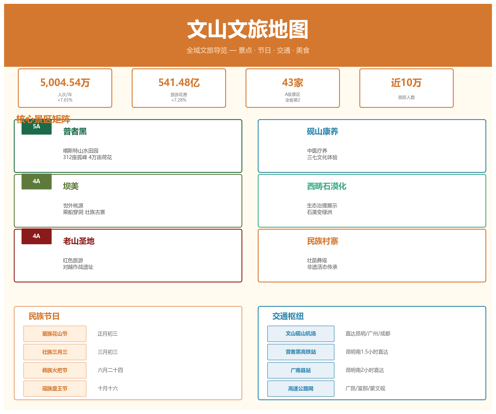

# 文山文旅地图

> 跨分类综合笔记 — 景点、民族节日、交通攻略、美食特产的全方位文旅导览。

---

## 一、2025 年旅游大数据

| 指标 | 数值 | 同比 |
|------|------|------|
| 接待游客 | **5,004.54 万人次** | +7.65% |
| 旅游花费 | **541.48 亿元** | +7.28% |
| 旅居人数 | 近 **10 万人** | — |
| A 级景区 | **43 家**（全省第二） | — |

> 数据来源：[[../06-文化旅游/文旅深度报告|文旅深度报告]]

---

## 二、核心景区矩阵

### 2.1 普者黑 — 5A 喀斯特山水田园

| 项目 | 详情 |
|------|------|
| 等级 | 国家 5A 级旅游景区 |
| 位置 | 丘北县 |
| 特色 | 312 座孤峰、83 个溶洞、54 个湖泊，万亩荷塘 |
| 最佳季节 | 6-8 月（荷花盛开） |
| 交通 | 普者黑高铁站距景区 9.8 km；文山砚山机场 85.7 km |

**核心体验**：乘柳叶舟穿行荷花水路、登青龙山观全景、天鹅湖观鸟、仙人洞村彝族风情。

**最新动态（2026）**：推进"四个一体化"开发重构，向世界级旅游景区目标迈进。

> 详见：[[../06-文化旅游/普者黑|普者黑]]、[[../06-文化旅游/普者黑旅游攻略|普者黑旅游攻略]]、[[../06-文化旅游/普者黑景区2026年旅游新进展|普者黑2026新进展]]、[[../03-行政区划/丘北县深度|丘北县深度]]

### 2.2 坝美 — 4A 世外桃源

| 项目 | 详情 |
|------|------|
| 等级 | 国家 4A 级旅游景区 |
| 位置 | 广南县 |
| 特色 | "林尽水源，便得一山，山有小口，仿佛若有光"——乘船穿溶洞而入的隐世村落 |
| 最佳季节 | 全年皆宜，春季桃花盛开最佳 |

**核心体验**：三段溶洞水陆行舟、壮家吊脚楼、田园耕作实景。

> 详见：[[../06-文化旅游/坝美|坝美]]、[[../06-文化旅游/坝美旅游攻略|坝美旅游攻略]]、[[../03-行政区划/广南县深度|广南县深度]]

### 2.3 老山圣地 — 4A 红色旅游

| 项目 | 详情 |
|------|------|
| 等级 | 国家 4A 级旅游景区 |
| 位置 | 麻栗坡县 |
| 特色 | 对越自卫还击战主战场，爱国主义教育基地 |
| 核心点位 | 老山主峰、老山作战纪念馆、烈士陵园 |

> 详见：[[../06-文化旅游/老山圣地|老山圣地]]、[[../03-行政区划/麻栗坡县深度|麻栗坡县深度]]

### 2.4 砚山康养 — 中医药养生新业态

| 项目 | 详情 |
|------|------|
| 位置 | 砚山县 |
| 特色 | 中医药康养 + 三七养生旅游，融合中医理疗、药膳、森林康养 |
| 定位 | 新兴康养旅游目的地 |

> 详见：[[../06-文化旅游/砚山康养|砚山康养]]、[[../03-行政区划/砚山县深度|砚山县深度]]

### 2.5 其他重要景区

全州 43 家 A 级景区，除上述 4 个核心景区外还包括：

| 景区 | 等级 | 位置 | 特色 |
|------|------|------|------|
| 西畴国家石漠公园 | 4A | 西畴 | "搬家不如搬石头"的石漠化治理奇迹 |
| 七都古镇 | 新建 | 文山市 | 历史文化街区 |
| 句町夜花街 | 新建 | 广南 | 句町文化主题夜游 |
| 雾缦云山 | 新建 | — | 客运索道观光 |
| 石斛湾民宿 | 精品民宿 | — | 石斛主题康养民宿 |
| 伟光星河营地 | 露营地 | — | 户外星空营地 |

> 详见：[[../06-文化旅游/更多景点|更多景点]]

---

## 三、民族节日年历

文山 11 个世居民族，一年四季节庆不断。以下是主要节日的时间轴：

| 时间 | 节日 | 民族 | 看点 |
|------|------|------|------|
| 农历正月 | **踩花山** | 苗族 | 芦笙舞、斗牛、对歌、爬花杆 |
| 农历三月 | **陇端节** | 壮族 | "壮族的春节"，祭龙、对歌、抛绣球 |
| 农历三月三 | **壮族三月三** | 壮族 | 五色糯米饭、抢花炮、扁担舞 |
| 农历六月 | **火把节** | 彝族 | 打歌、撒火把、斗牛、赛马 |
| 农历六月 | **盘王节** | 瑶族 | 长鼓舞、祭盘王 |
| 农历十月 | **牛王节** | 壮族 | 祭祀耕牛、做糍粑 |
| 公历 4 月 | **泼水节** | 傣族 | 泼水祝福、放高升、龙舟赛 |

> 详见：[[../04-人口与民族/民族文化与节日|民族文化与节日]]、[[../04-人口与民族/非遗与传统文化|非遗与传统文化]]

---

## 四、非遗文化体验

| 项目 | 级别 | 类型 |
|------|------|------|
| **坡芽歌书** | 国家级非遗 | 壮族古老文字符号与音乐遗产 |
| **铜鼓舞** | 国家级非遗 | 彝族、壮族祭祀舞蹈，文山为中国铜鼓之乡 |
| **壮族刺绣** | 省级非遗 | 精美壮锦手工技艺 |
| **苗族蜡染** | 省级非遗 | 传统印染工艺 |

> 详见：[[../04-人口与民族/坡芽歌书深度|坡芽歌书深度]]、[[../04-人口与民族/铜鼓文化|铜鼓文化]]

---

## 五、交通攻略

### 外部抵达

| 方式 | 路线 | 时长参考 |
|------|------|----------|
| 高铁 | 昆明南 → 普者黑站 | 约 1 小时 |
| 高铁 | 南宁 → 普者黑站 | 约 2.5 小时 |
| 飞机 | 飞昆明长水 → 转高铁或自驾 | — |
| 飞机 | 飞文山砚山机场（航线有限） | — |
| 自驾 | G80 广昆高速、G5615 天猴高速 | — |

### 内部交通

| 区间 | 推荐方式 | 参考时间 |
|------|----------|----------|
| 普者黑站 → 普者黑景区 | 公交/出租车 | 约 20 分钟 |
| 文山市 → 丘北（普者黑） | 大巴/自驾 | 约 1.5 小时 |
| 文山市 → 广南（坝美） | 大巴/自驾 | 约 2.5 小时 |
| 文山市 → 麻栗坡（老山） | 自驾/包车 | 约 2 小时 |
| 文山市 → 砚山 | 自驾 | 约 30 分钟 |

> 详见：[[../08-交通与基础设施/交通概况|交通概况]]、[[../06-文化旅游/旅游线路规划|旅游线路规划]]

---

## 六、推荐旅游线路

### 线路一：喀斯特山水经典（3-4 天）
**昆明 → 普者黑（2 天） → 坝美（1 天） → 返回**
- Day 1-2：普者黑荷花水路、青龙山、仙人洞村
- Day 3：坝美溶洞入村、壮乡田园

### 线路二：红色 + 边境深度（3 天）
**文山 → 麻栗坡老山圣地（1 天） → 天保口岸（半天） → 西畴石漠公园（1 天）**
- 老山作战纪念馆、主峰
- 中越边境口岸风情
- "西畴精神"实景体验

### 线路三：康养休闲慢旅行（3-4 天）
**文山 → 砚山康养（1-2 天） → 普者黑（2 天）**
- 中医药理疗、三七药膳
- 普者黑慢游

### 线路四：民族风情全景（5-7 天）
**覆盖普者黑 + 坝美 + 老山 + 配合节庆时间**
- 按[[#三、民族节日年历|民族节日年历]]选择出行时间，收获沉浸式文化体验

> 详见：[[../06-文化旅游/旅游线路规划|旅游线路规划]]

---

## 七、美食与特产地图

| 地区 | 必尝 | 伴手礼 |
|------|------|--------|
| 文山市 | 三七汽锅鸡、文山凉品 | 三七制品 |
| 丘北 | 荷花宴、辣椒炒肉 | 丘北辣椒 |
| 广南 | 八宝米饭、岜夯鸡 | 广南八宝米 |
| 富宁 | 八角香料菜 | 富宁八角 |
| 砚山 | 三七药膳 | 铁皮石斛 |
| 麻栗坡 | 边境特色小吃 | 老山茶 |

> 详见：[[../07-特产与资源/特色农产品|特色农产品]]

---

> 合成来源：06-文化旅游（12 篇）、04-人口与民族（11 篇）、03-行政区划（9 篇）、08-交通与基础设施（8 篇）、07-特产与资源（8 篇）中文旅相关笔记。数据截止 2026 年 5 月。