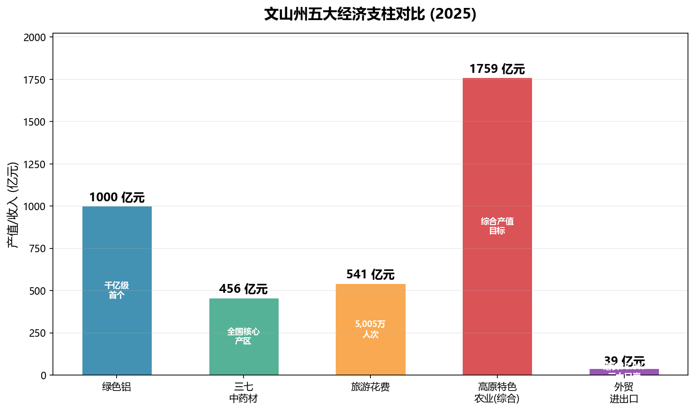

# 文山经济全景

> 跨分类综合笔记 — 串联农业、工业、外贸、交通、能源五大经济维度的全州经济画像。

---

## 一、经济基本面（2024-2025）

| 指标 | 2024 年 | 2025 年 |
|------|---------|---------|
| GDP | 1,549.11 亿元 | 1,632.64 亿元 |
| 增速 | 6.0%（全省前列） | — |
| 人均 GDP | 45,771 元 | — |
| 一般公共预算收入 | 69.43 亿元 | — |
| 城镇居民人均可支配收入 | 38,989 元 | — |
| 农村居民人均可支配收入 | 15,444 元 | — |
| 外贸进出口总额 | — | 39 亿元（+38.8%） |

文山州正处于从传统农业州向 **"绿色铝 + 高原特色农业 + 口岸经济"** 三轮驱动的现代产业体系加速转型期。



> 详见：[[../05-经济发展/经济概况2025|经济概况2025]]、[[../00-总览/核心数据速查|核心数据速查]]

---

## 二、农业：高原特色农业四大支柱

### 2.1 三七 — 世界三七之都

- **综合产值目标**：456 亿元
- **核心区域**：文山市、砚山县
- **全国份额**：三七原产地和主产区，产品辐射全球 40 余国
- **产业链**：种植 → 加工（饮片/提取物） → 药品/保健品 → 国际市场
- **最新动态**：2025-2026 年推动三七产业规范化种植与品牌建设，加大国际市场开拓力度

> 详见：[[../07-特产与资源/三七|三七]]、[[../05-经济发展/三七产业|三七产业]]、[[../05-经济发展/三七产业2025-2026最新动态|三七产业最新动态]]

### 2.2 丘北辣椒 — 中国辣椒之乡

- **主产区**：丘北县
- **品牌地位**：云南最具代表性的辣椒品种之一，国家地理标志产品
- **产业链**：种植 → 干制/加工 → 调味品/食品 → 国内及东南亚市场

> 详见：[[../07-特产与资源/丘北辣椒产业|丘北辣椒产业]]

### 2.3 广南八宝米 — 云南六大名米

- **主产区**：广南县八宝镇
- **品牌地位**：国家地理标志产品，"云南六大名米"之一
- **特色**：米粒细长、口感软糯、明清时期曾为贡米

> 详见：[[../07-特产与资源/广南八宝米|广南八宝米]]

### 2.4 富宁八角 — 中国八角之乡

- **主产区**：富宁县
- **规模**：全国八角种植面积最大产区之一
- **产业链**：种植 → 干果/茴油加工 → 调味品/香料 → 出口

> 详见：[[../07-特产与资源/富宁八角产业|富宁八角产业]]

### 其他特色农产品

石斛、草果、茶叶、水果等多元品类协同发展。高原特色农业综合产值目标 **1,759 亿元**。粤港澳大湾区"菜篮子"基地地位稳步提升，文山蔬菜占全省供粤港澳蔬菜的 **13%**。

> 详见：[[../07-特产与资源/特色农产品|特色农产品]]、[[../05-经济发展/高原特色农业|高原特色农业]]

---

## 三、工业：绿色铝千亿产业集群

### 3.1 产能规模

- **绿色铝产能**：343 万吨，占全国近 **1/10**
- **核心园区**：云南绿色铝创新产业园（砚山县）
- **发展目标**：综合产值 **1,000 亿元**

### 3.2 产业链布局

```
铝土矿（本地 + 进口）
    ↓
氧化铝 → 电解铝（绿色水电）
    ↓
铝加工（汽车零部件 / 建筑铝材 / 终端消费品）
    ↓
"3 个百万吨级"加工集群
```

- **汽车零部件**：依托毗邻广西汽车产业集群的区位优势
- **建筑铝材**：面向西南及东南亚基建市场
- **终端消费品**：铝箔、铝制家居等高附加值产品

### 3.3 最新进展

- 2025-2026 年新上马 **年产 11 万吨绿色铝箔** 等重点项目
- 以绿色水电为能源基础的低碳铝生产模式，契合全球碳中和趋势

> 详见：[[../05-经济发展/绿色铝产业|绿色铝产业]]、[[../05-经济发展/绿色铝产业2025-2026新项目|绿色铝产业新项目]]、[[../03-行政区划/砚山县深度|砚山县深度]]

---

## 四、能源：资源禀赋与绿色转型

| 能源类型 | 资源概况 |
|----------|----------|
| 水能 | 盘龙河等水系理论蕴藏丰富，已开发多座水电站 |
| 风能 | 丘北、砚山等高海拔区域风资源优越 |
| 太阳能 | 年均日照 1,600-2,000 小时，光伏开发潜力大 |
| 矿产资源 | 铝土矿、锰矿、锑矿等储量丰富 |

### 碳中和路径

- 依托 97% 山区植被固碳潜力 + 绿色能源结构
- 绿色铝产业以水电为基础，全链条低碳化
- 石漠化治理与碳汇交易联动探索

> 详见：[[../05-经济发展/新能源发展|新能源发展]]、[[../05-经济发展/能源资源与电力|能源资源与电力]]、[[../05-经济发展/碳中和路径|碳中和路径]]、[[../07-特产与资源/矿产资源|矿产资源]]

---

## 五、外贸：口岸经济新引擎

### 5.1 三大口岸

| 口岸 | 位置 | 定位 |
|------|------|------|
| **天保口岸** | 麻栗坡县 | 国家级口岸，对越最大陆路口岸 |
| **都龙口岸** | 马关县 | 省级口岸，矿产资源进出口通道 |
| **田蓬口岸** | 富宁县 | 国家级口岸，滇东南对越贸易新通道 |

### 5.2 外贸数据

- 2025 年外贸进出口总额：**39 亿元**，同比增长 **38.8%**
- 主要出口：绿色铝产品、三七及中药材、高原果蔬、鲜切花
- 2026 年一季度鲜切花实现产业破零，出口日本 46 万枝 / 70 万元
- 成功举办中越边交会、"文山·睦邻"交流合作周等品牌活动
- 省外产业项目招商 140 个，到位资金 158.7 亿元

> 详见：[[../05-经济发展/外贸发展|外贸发展]]、[[../08-交通与基础设施/口岸与边境通道|口岸与边境通道]]、[[../09-政策与治理/口岸经济|口岸经济]]

---

## 六、交通：从瓶颈到立体突破

### 6.1 公路

- **G5615 天保至猴桥高速**：天保口岸—文山段 127.6 公里
- 323 国道横穿全境
- 县县通高速格局基本形成

### 6.2 铁路

| 项目 | 状态 |
|------|------|
| 普者黑高铁站 | 运营中（距普者黑景区 9.8 km） |
| 文山至蒙自铁路 | 建设中 |
| 文山至广西铁路 | 前期工作 |
| 丘北至文山高铁 | 前期工作 |

### 6.3 航空

- 文山砚山机场：运营中
- 丘北机场：前期工作

### 6.4 水运

- 百色水利枢纽通航设施：建设中
- 富宁港：接入珠江航运通道，打通云南通江达海新出口

> 详见：[[../08-交通与基础设施/交通概况|交通概况]]、[[../08-交通与基础设施/文蒙铁路专题|文蒙铁路专题]]、[[../08-交通与基础设施/在建项目|在建项目]]

---

## 七、三层驱动：理解文山经济的框架

```
第一层「资源驱动」
  三七 | 辣椒 | 八宝米 | 八角 | 铝土矿 | 水能 | 风能 | 太阳能
        ↓
第二层「产业转化」
  高原特色农业 1,759 亿 | 绿色铝 1,000 亿 | 新能源
        ↓
第三层「通道赋能」
  三大口岸 → 越南/东盟市场
  文蒙铁路 + 富宁港 → 珠三角/北部湾
  粤港澳大湾区"菜篮子" → 高端农产品市场
```

这一 **"资源→产业→通道"** 三层框架，是理解文山从传统农业州向区域经济枢纽转型的核心逻辑。

---

> 合成来源：05-经济发展（22 篇）、07-特产与资源（8 篇）、08-交通与基础设施（8 篇）、09-政策与治理（9 篇）中的经济相关笔记。数据截止 2026 年 5 月。